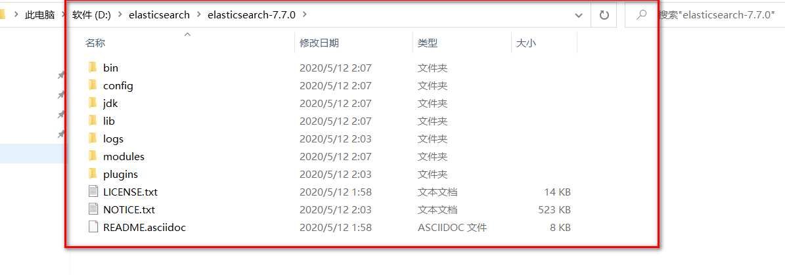

# ElasticSearch安装

声明：JDK1.8 ，最低要求！ ElasticSearch 客户端，界面工具！

Java开发，ElasticSearch 的版本和我们之后对应的 Java 的核心jar包！ 版本对应！JDK 环境是正常！

> 下载

官网：https://www.elastic.co/


> 安装

1、解压就可以使用了



2、熟悉目录！

```
bin 启动文件
config 配置文件
log4j2 日志配置文件
jvm.options java 虚拟机相关的配置
elasticsearch.yml elasticsearch 的配置文件！ 默认 9200 端口！ 跨域！
lib 相关jar包
logs 日志！
modules 功能模块
plugins 插件！
```

3、访问测试


4、访问测试！


> 安装可视化界面 es head的插件

**需要安装node.js和npm**
1、下载地址：https://github.com/mobz/elasticsearch-head/

2、启动
```
npm install
npm run start
```
3、连接测试发现，存在跨越问题：配置es
```
http.cors.enable: true
http.cors.allow-origin: "*"
```
4、重启es服务器，然后再次连接


初学，就把es当做一个数据库！ （可以建立索引（库），文档（库中的数据！））

这个head我们就把它当做数据展示工具！我们后面所有的查询，Kibana！
>了解ELK

ELK是Elasticsearch、Logstash、Kibana三大开源框架首字母大写简称。市面上也被成为Elastic
Stack。其中Elasticsearch是一个基于Lucene、分布式、通过Restful方式进行交互的近实时搜索平台框
架。像类似百度、谷歌这种大数据全文搜索引擎的场景都可以使用Elasticsearch作为底层支持框架，可
见Elasticsearch提供的搜索能力确实强大,市面上很多时候我们简称Elasticsearch为es。Logstash是ELK
的中央数据流引擎，用于从不同目标（文件/数据存储/MQ）收集的不同格式数据，经过过滤后支持输出
到不同目的地（文件/MQ/redis/elasticsearch/kafka等）。Kibana可以将elasticsearch的数据通过友好
的页面展示出来，提供实时分析的功能。

市面上很多开发只要提到ELK能够一致说出它是一个日志分析架构技术栈总称，但实际上ELK不仅仅适用
于日志分析，它还可以支持其它任何数据分析和收集的场景，日志分析和收集只是更具有代表性。并非
唯一性。


>安装Kibana

Kibana是一个针对Elasticsearch的开源分析及可视化平台，用来搜索、查看交互存储在Elasticsearch索
引中的数据。使用Kibana，可以通过各种图表进行高级数据分析及展示。Kibana让海量数据更容易理
解。它操作简单，基于浏览器的用户界面可以快速创建仪表板（dashboard）实时显示Elasticsearch查
询动态。设置Kibana非常简单。无需编码或者额外的基础架构，几分钟内就可以完成Kibana安装并启动
Elasticsearch索引监测。

官网：https://www.elastic.co/cn/kibana

Kibana 版本要和 Es 一致！


**下载完毕后，解压也需要一些时间！是一个标准的工程！**

**好处：ELK 基本上都是拆箱即用！**

>启动测试

1、解压后端的目录


2、启动


3、访问测试


4、开发工具！ （Post、curl、head、谷歌浏览器插件测试！）


我们之后的所有操作都在这里进行编写！很多学习大数据的人，Hadoop！

5、汉化！自己修改kibana配置即可！ zh-CN！


