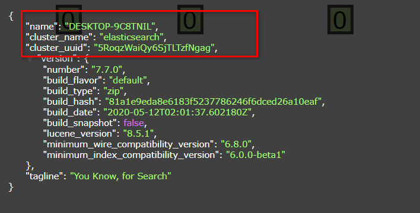
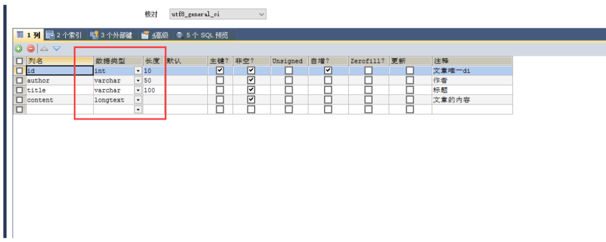
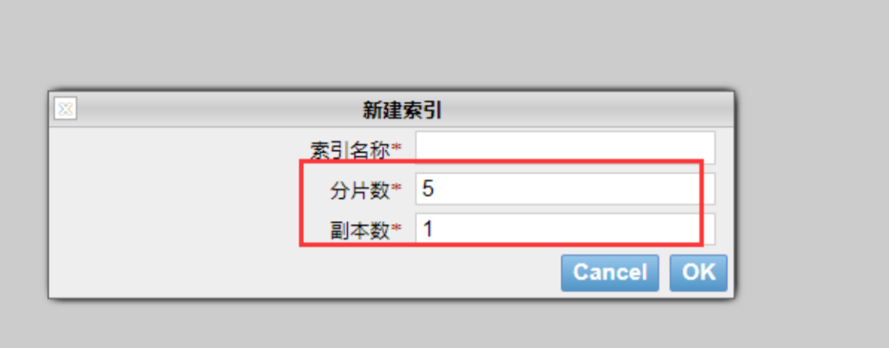
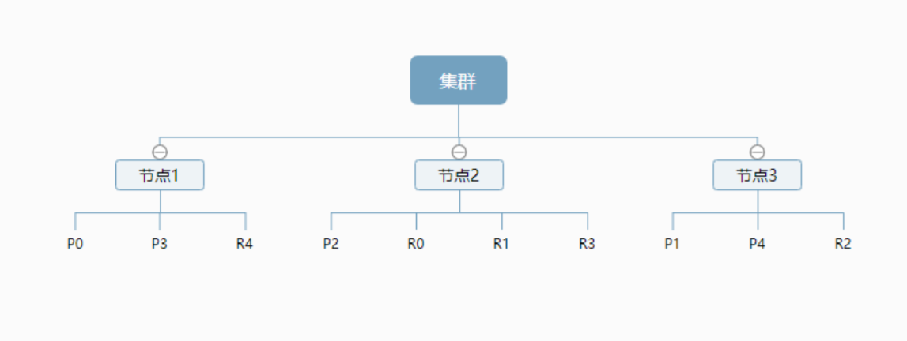
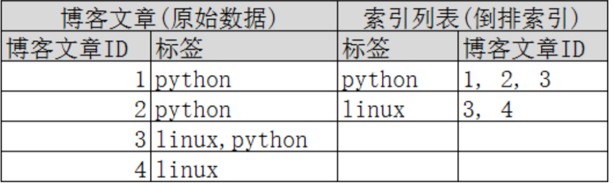

# ElasticSearch核心概念

1、索引

2、字段类型（mapping）

3、文档（documents）

> 概述

在前面的学习中，我们已经掌握了es是什么，同时也把es的服务已经安装启动，那么es是如何去存储数
据，数据结构是什么，又是如何实现搜索的呢？我们先来聊聊ElasticSearch的相关概念吧！

**集群，节点，索引，类型，文档，分片，映射是什么？**

> elasticsearch是面向文档，关系行数据库 和 elasticsearch 客观的对比！一切都是JSON！

|Relational DB|Elasticsearch|
|---|---|
|数据库(database)|索引(indices)|
|表(tables)|types|
|行(rows)|documents|
|字段(columns)|fields|

elasticsearch(集群)中可以包含多个索引(数据库)，每个索引中可以包含多个类型(表)，每个类型下又包
含多 个文档(行)，每个文档中又包含多个字段(列)。

**物理设计：**

elasticsearch 在后台把每个**索引划分成多个分片**，每分分片可以在集群中的不同服务器间迁移
一个人就是一个集群！默认的集群名称就是 elaticsearh



**逻辑设计：**

一个索引类型中，包含多个文档，比如说文档1，文档2。 当我们索引一篇文档时，可以通过这样的一各
顺序找到 它: 索引 ▷ 类型 ▷ 文档ID ，通过这个组合我们就能索引到某个具体的文档。 注意:ID不必是整
数，实际上它是个字 符串。

>文档

就是我们的一条条数据
```
user
1 zhangsan 18
2 kuangshen 3
```
之前说elasticsearch是面向文档的，那么就意味着索引和搜索数据的最小单位是文档，elasticsearch
中，文档有几个 重要属性 :
 * 自我包含，一篇文档同时包含字段和对应的值，也就是同时包含 key:value！
 * 可以是层次型的，一个文档中包含自文档，复杂的逻辑实体就是这么来的！ {就是一个json对象！
   fastjson进行自动转换！}
 * 灵活的结构，文档不依赖预先定义的模式，我们知道关系型数据库中，要提前定义字段才能使用，
  在elasticsearch中，对于字段是非常灵活的，有时候，我们可以忽略该字段，或者动态的添加一个
  新的字段。
 
尽管我们可以随意的新增或者忽略某个字段，但是，每个字段的类型非常重要，比如一个年龄字段类
型，可以是字符 串也可以是整形。因为elasticsearch会保存字段和类型之间的映射及其他的设置。这种
映射具体到每个映射的每种类型，这也是为什么在elasticsearch中，类型有时候也称为映射类型。

>类型



类型是文档的逻辑容器，就像关系型数据库一样，表格是行的容器。 类型中对于字段的定义称为映射，
比如 name 映 射为字符串类型。 我们说文档是无模式的，它们不需要拥有映射中所定义的所有字段，
比如新增一个字段，那么elasticsearch是怎么做的呢?elasticsearch会自动的将新字段加入映射，但是这
个字段的不确定它是什么类型，elasticsearch就开始猜，如果这个值是18，那么elasticsearch会认为它
是整形。 但是elasticsearch也可能猜不对， 所以最安全的方式就是提前定义好所需要的映射，这点跟关
系型数据库殊途同归了，先定义好字段，然后再使用，别 整什么幺蛾子。

>索引

就是数据库！

索引是映射类型的容器，elasticsearch中的索引是一个非常大的文档集合。索引存储了映射类型的字段

和其他设置。 然后它们被存储到了各个分片上了。 我们来研究下分片是如何工作的。

**物理设计 ：节点和分片 如何工作**



**一个集群至少有一个节点，而一个节点就是一个elasricsearch进程，节点可以有多个索引默认的，如果
  你创建索引，那么索引将会有个5个分片 ( primary shard ,又称主分片 ) 构成的，每一个主分片会有一个
  副本 ( replica shard ,又称复制分片 )**



>倒排索引

**elasticsearch使用的是一种称为倒排索引的结构，采用Lucene倒排索作为底层。这种结构适用于快速的
  全文搜索， 一个索引由文档中所有不重复的列表构成，对于每一个词，都有一个包含它的文档列表。 例
  如，现在有两个文档， 每个文档包含如下内容：**

```
Study every day, good good up to forever # 文档1包含的内容
To forever, study every day, good good up # 文档2包含的内容
``` 
**为了创建倒排索引，我们首先要将每个文档拆分成独立的词(或称为词条或者tokens)，然后创建一个包
  含所有不重 复的词条的排序列表，然后列出每个词条出现在哪个文档 :**

|term|doc_1|doc_2|
|---|---|---|
|Study|√|×|
|To|×|×|
|every|√|√|
|forever|√|√|
|day|√|√|
|study|×|√|
|good|√|√|
|every|√|√|
|to|√|×|
|up|√|√|

**现在，我们试图搜索 to forever，只需要查看包含每个词条的文档 score**

|term|doc_1|doc_2|
|---|---|---|
|to|√|×|
|forever|√|√|
|total|2|1|

**两个文档都匹配，但是第一个文档比第二个匹配程度更高。如果没有别的条件，现在，这两个包含关键
  字的文档都将返回。**
  
** 再来看一个示例，比如我们通过博客标签来搜索博客文章。那么倒排索引列表就是这样的一个结构 **



如果要搜索含有 python 标签的文章，那相对于查找所有原始数据而言，查找倒排索引后的数据将会快
的多。只需要 查看标签这一栏，然后获取相关的文章ID即可。完全过滤掉无关的所有数据，提高效率！

elasticsearch的索引和Lucene的索引对比

在elasticsearch中， 索引 （库）这个词被频繁使用，这就是术语的使用。 在elasticsearch中，索引被
分为多个分片，每份 分片是一个Lucene的索引。**所以一个elasticsearch索引是由多个Lucene索引组成
的。**别问为什么，谁让elasticsearch使用Lucene作为底层呢! 如无特指，说起索引都是指elasticsearch
的索引。

接下来的一切操作都在kibana中Dev Tools下的Console里完成。基础操作！


