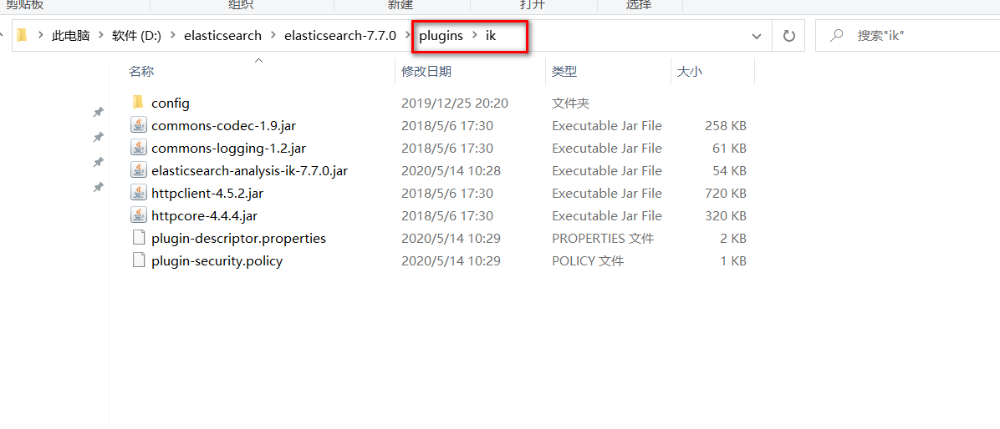
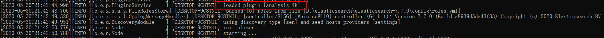
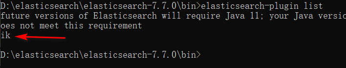
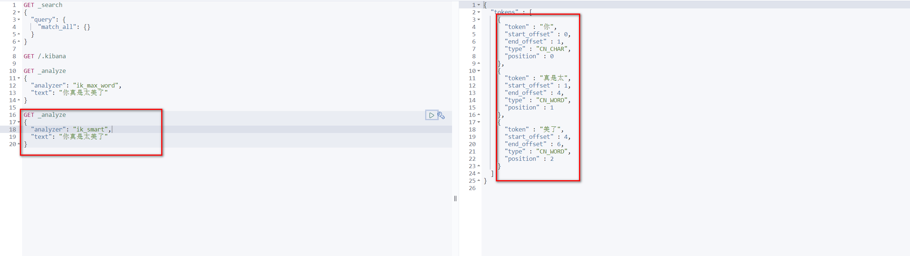
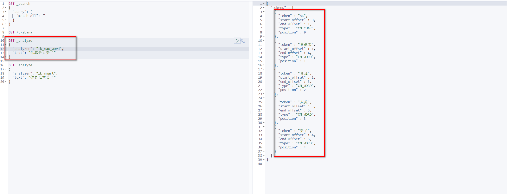
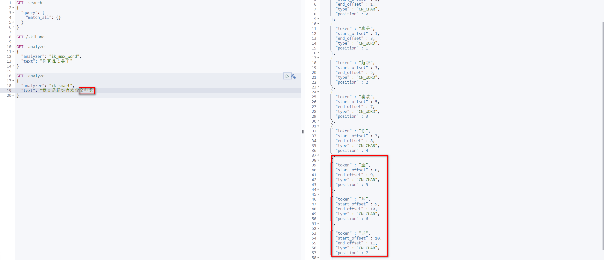
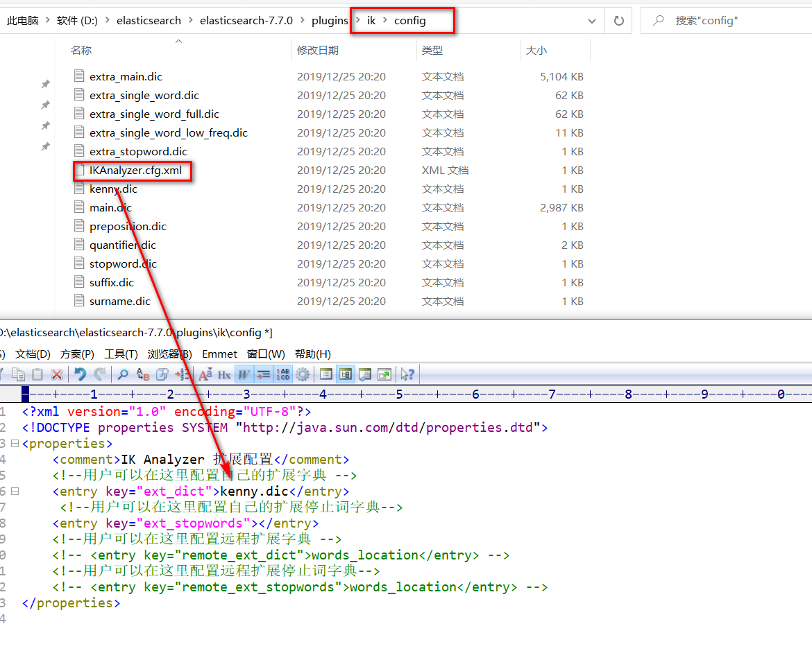
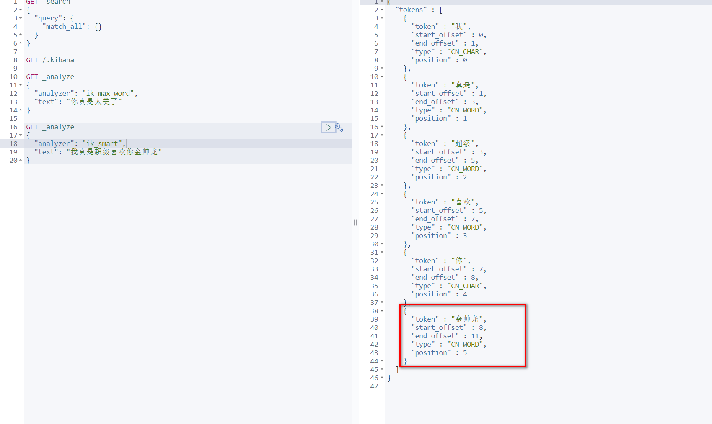

# IK分词器插件

> 什么是IK分词器？

分词：即把一段中文或者别的划分成一个个的关键字，我们在搜索时候会把自己的信息进行分词，会把
数据库中或者索引库中的数据进行分词，然后进行一个匹配操作，默认的中文分词是将每个字看成一个
词，比如 “我爱狂神” 会被分为"我","爱","狂","神"，这显然是不符合要求的，所以我们需要安装中文分词
器ik来解决这个问题。

如果要使用中文，建议使用ik分词器！

IK提供了两个分词算法：ik_smart 和 ik_max_word，其中 ik_smart 为最少切分，ik_max_word为最细
粒度划分！一会我们测试！

>安装

1、https://github.com/medcl/elasticsearch-analysis-ik

2、下载完毕之后，放入到我们的elasticsearch 插件即可！

3、重启观察ES，可以看到ik分词器被加载了！

4、elasticsearch-plugin 可以通过这个命令来查看加载进来的插件

5、使用kibana测试！

>查看不同的分词效果

其中 ik_smart 为最少切分

ik_max_word为最细粒度划分！穷尽词库的可能！字典！

>我们输入 我真是超级喜欢你金帅龙

**发现问题：金帅龙人名被拆分了！**
这种自己需要的词，需要自己加到我们的分词器的字典中！

>ik 分词器增加自己的配置！

重启es，看细节！

**在测试一下人名是否被拆分！**

**以后的话，我们需要自己配置 分词就在自己定义的dic文件中进行配置即可！**

# Rest风格说明

一种软件架构风格，而不是标准，只是提供了一组设计原则和约束条件。它主要用于客户端和服务器交
互类的软件。基于这个风格设计的软件可以更简洁，更有层次，更易于实现缓存等机制。

基本Rest命令说明：

|method|url地址|描述|
|---|---|---|
|PUT|loaclhost:9200/索引名称/类型名称/文档id|创建文档(指定文档id)|
|POST|loaclhost:9200/索引名称/类型名称|创建文档(随机文档id)|
|POST|loaclhost:9200/索引名称/类型名称/文档id/_update|修改文档|
|DELETE|loaclhost:9200/索引名称/类型名称/文档id|删除文档|
|GET|loaclhost:9200/索引名称/类型名称/文档id|查询文档通过文档id|
|POST|loaclhost:9200/索引名称/类型名称/_search|查询所有数据|

