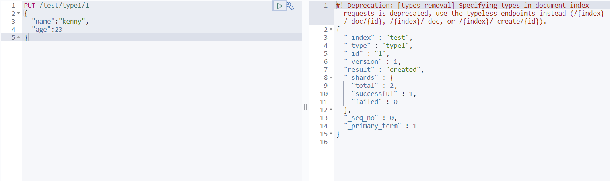
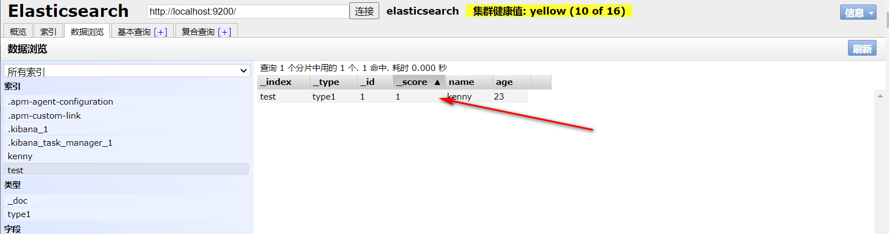
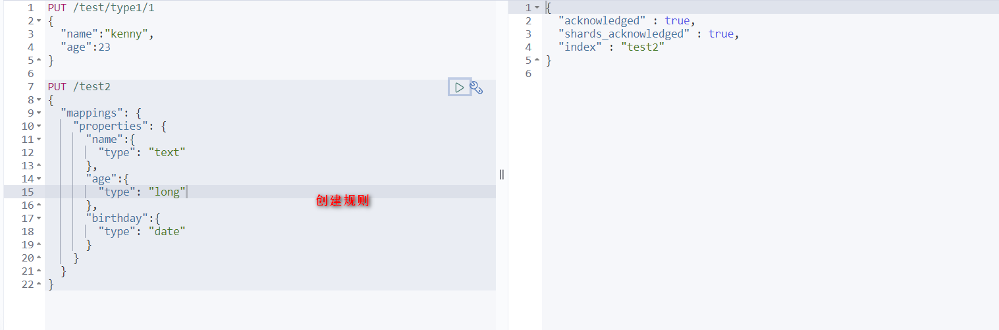
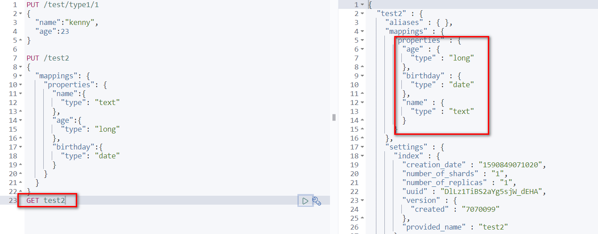
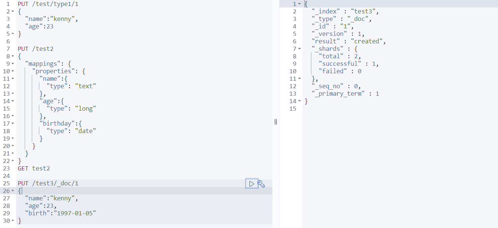
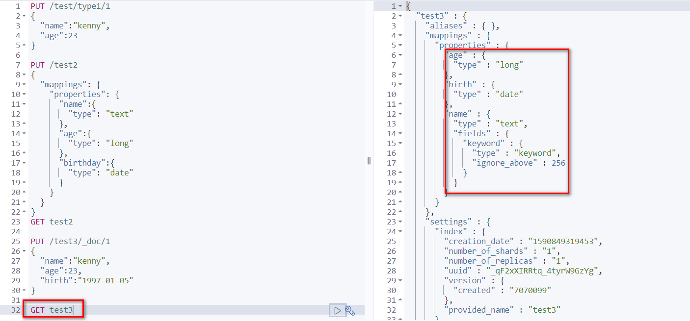
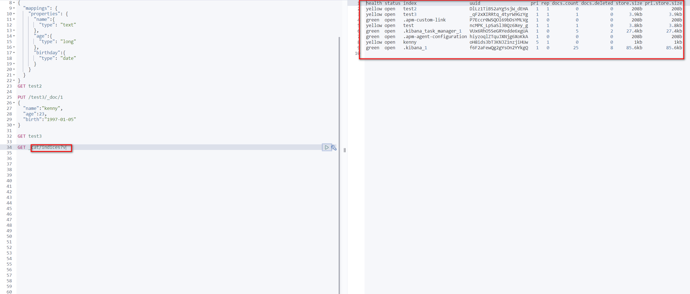
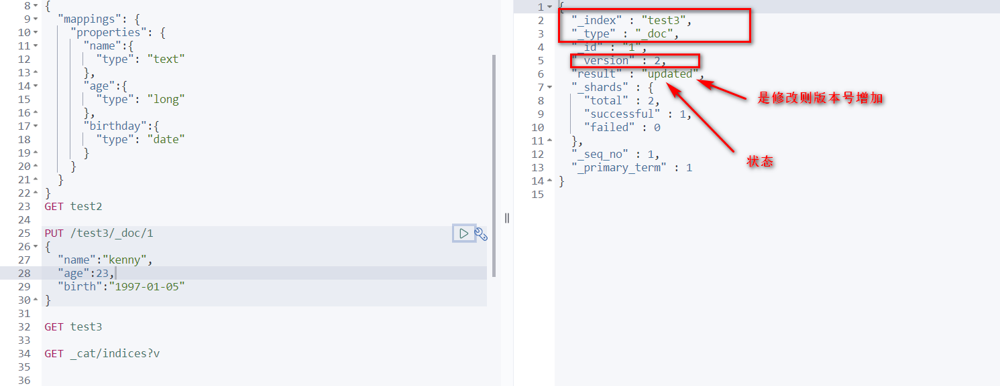
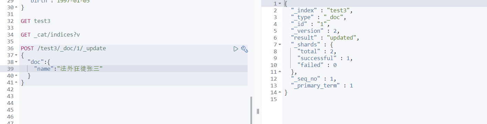

# 关于索引的基本操作

1、创建一个索引！
```
PUT /索引名/~类型名~/文档id
{请求体}
```


**完成了自动增加了索引！数据也成功的添加了，这就是我说大家在初期可以把它当做数据库学习的原
因！**



3、那么 name 这个字段用不用指定类型呢。毕竟我们关系型数据库 是需要指定类型的啊 
 * 字符串类型   
 text 、keyword
 * 数值类型  
 long, integer, short, byte, double, float, half_float, scaled_float
 * 日期类型  
 date
 * te布尔值类型  
 boolean
 * 二进制类型  
 binary
 * 等等......
 
4、指定字段的类型



获得这个规则！ 可以通过 GET 请求获取具体的信息！



5、查看默认的信息





如果自己的文档字段没有指定，那么es 就会给我们默认配置字段类型！

>虚心学习，这个世界上大佬很多！

**扩展： 通过命令 elasticsearch 索引情况！ 通过get _cat/ 可以获得es的当前的很多信息！**



>修改 提交还是使用PUT 即可！ 然后覆盖！最新办法！

**曾经！**



现在的方法！



这个好处就是想修改那个，就写那个，不用写不修改的值

>删除索引

**通过DELETE 命令实现删除、 根据你的请求来判断是删除索引还是删除文档记录！
  使用RESTFUL 风格是我们ES推荐大家使用的！**

