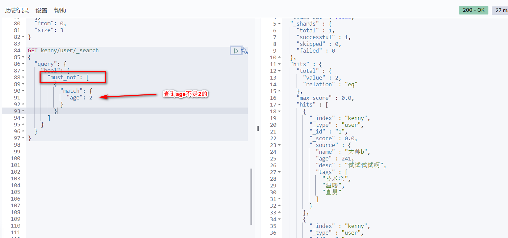

# 关于文档的基本操作（重点）

> 基本操作

```
PUT /kenny/user/1
{
  "name":"kenny",
  "age":"24",
  "desc":"一顿操作猛如虎，一看工资250",
  "tags":["技术宅","温暖","直男"]
}
```


2、获取数据 GET


3、更新数据


4、POST _update ，推荐使用这种更新方式！


## 简单的搜索！

```
GET kenny/user/1
```
简单的条件查询，可以根据默认的映射规则，产生基本的查询！


## 复杂操作搜索 select (排序，分页，高亮，模糊查询，精准查询！)


**输出结果**


**我们之后使用Java操作es ，所有的方法和对象就是这里面的 key！**

## 排序


## 分页查询


数据下标还是从0开始的，和学的所有数据结构是一样的！

/search/{current}/{pagesize}

## 布尔值查询

must(and) ,所有条件都要符合 where id = 1 and name = xxx


should(or) ,，所有的条件都要符合 where id = 1 or name = xxx


must_not （not）



过滤器filter


* gt 大于
* gte 大于等于
* lt 小于
* lte 小于等于


## 匹配多个条件


## 精准查询！

term 查询是直接通过倒排索引指定的词条进程精准查找的！

**关于分词**
 * term ，直接查询精确的
 * match，会使用分词器解析！（先分析文档，然后在通过分析的文档进行查询！）
 
**两个类型 text keyword**


**keyword字段类型不会被分词器解析

## 多个值匹配精确查询


## 高亮查询！


这些其实MySQL 也可以做，只是MySQL 效率比较低！
 * 匹配
 * 按照条件匹配
 * 精确匹配
 * 区间范围匹配
 * 匹配字段过滤
 * 多条件查询
 * 高亮查询
