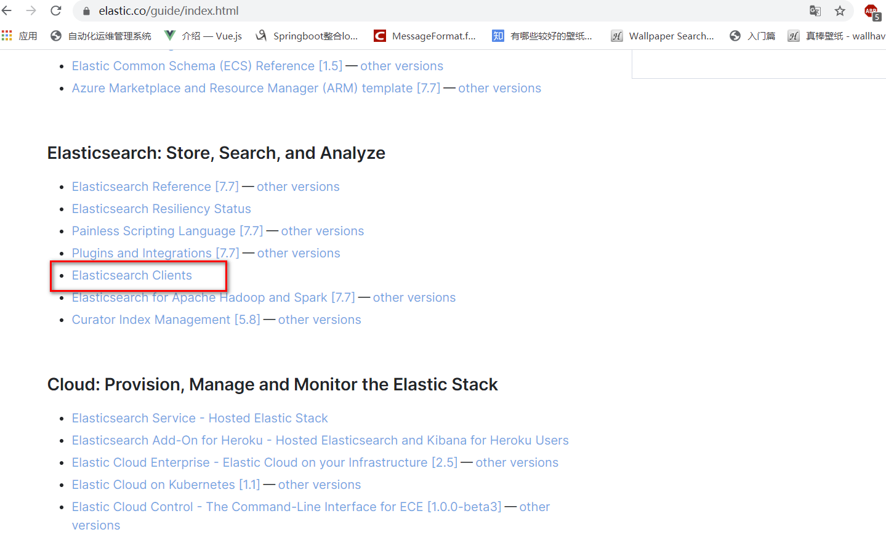
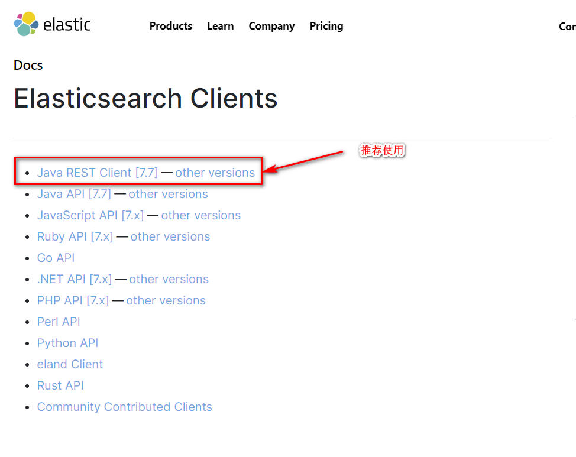
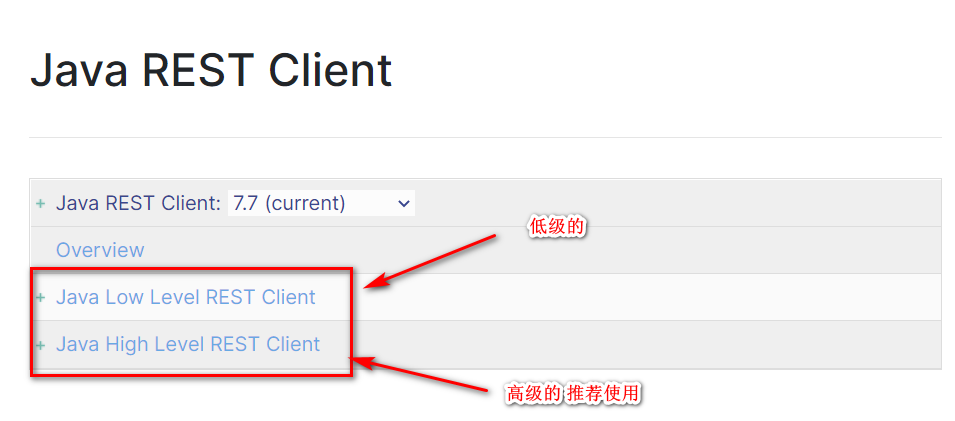
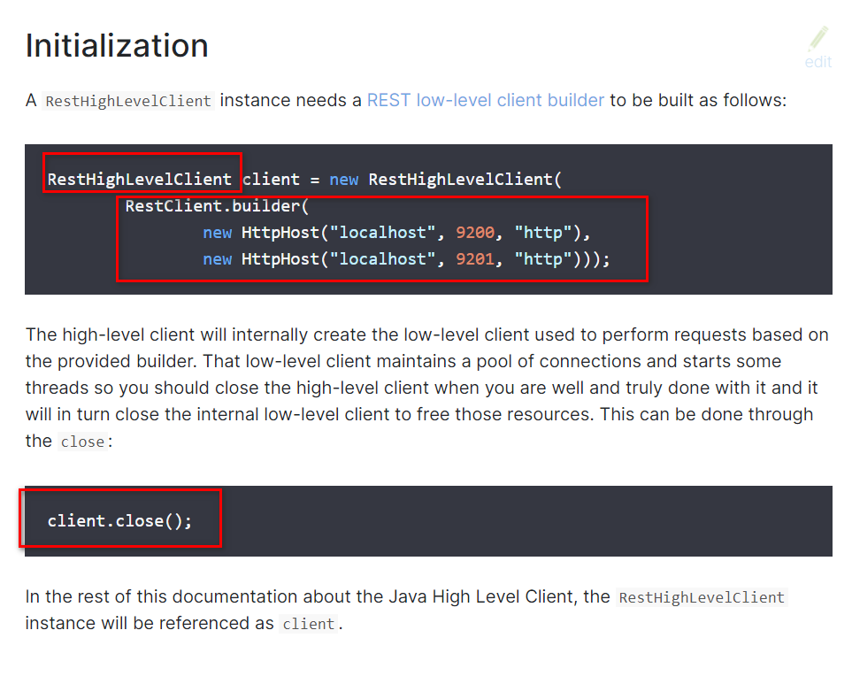
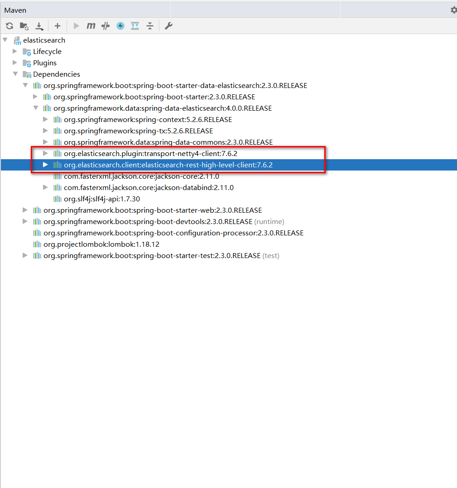
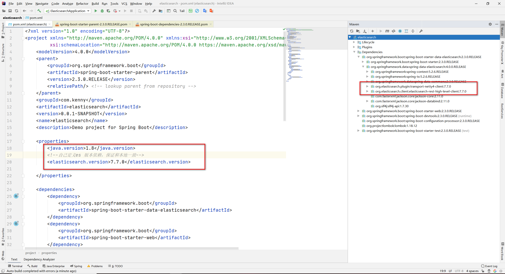
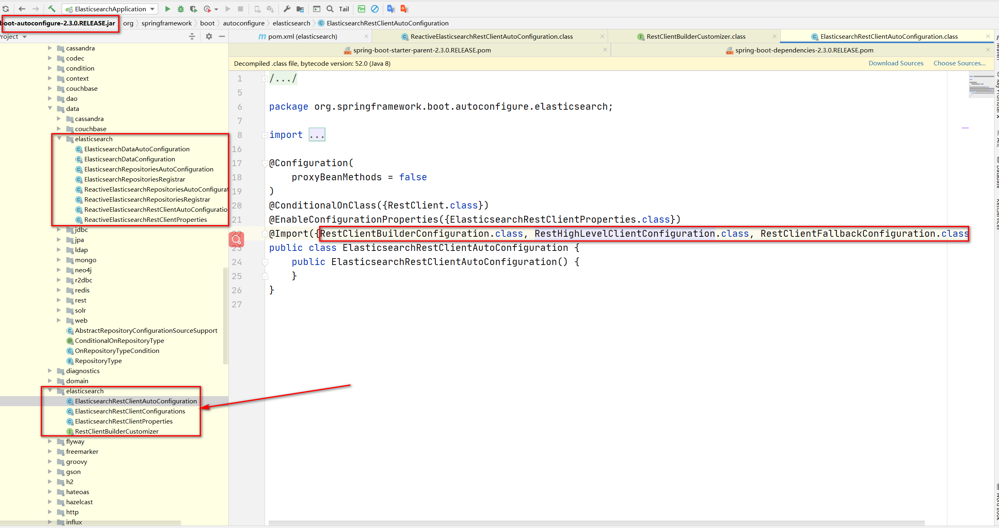

# 集成SpringBoot

> ## 找官方文档！







1、找到原生的依赖
```xml
<dependency>
    <groupId>org.elasticsearch.client</groupId>
    <artifactId>elasticsearch-rest-high-level-client</artifactId>
    <version>7.7.0</version>
</dependency>
```
2、找对象



3、分析这个类中的方法即可！

>配置基本的项目

**问题：一定要保证 我们的导入的依赖和我们的es 版本一致**





**源码中提供对象！**



**虽然这里导入3个类，静态内部类，核心类就一个！**

```java
package org.springframework.boot.autoconfigure.elasticsearch;

import java.time.Duration;
import org.apache.http.HttpHost;
import org.apache.http.auth.AuthScope;
import org.apache.http.auth.Credentials;
import org.apache.http.auth.UsernamePasswordCredentials;
import org.apache.http.client.CredentialsProvider;
import org.apache.http.client.config.RequestConfig.Builder;
import org.apache.http.impl.client.BasicCredentialsProvider;
import org.apache.http.impl.nio.client.HttpAsyncClientBuilder;
import org.elasticsearch.client.RestClient;
import org.elasticsearch.client.RestClientBuilder;
import org.elasticsearch.client.RestHighLevelClient;
import org.springframework.beans.factory.ObjectProvider;
import org.springframework.boot.autoconfigure.condition.ConditionalOnClass;
import org.springframework.boot.autoconfigure.condition.ConditionalOnMissingBean;
import org.springframework.boot.context.properties.PropertyMapper;
import org.springframework.context.annotation.Bean;
import org.springframework.context.annotation.Configuration;

class ElasticsearchRestClientConfigurations {
    ElasticsearchRestClientConfigurations() {
    }

    static class DefaultRestClientBuilderCustomizer implements RestClientBuilderCustomizer {
        private static final PropertyMapper map = PropertyMapper.get();
        private final ElasticsearchRestClientProperties properties;

        DefaultRestClientBuilderCustomizer(ElasticsearchRestClientProperties properties) {
            this.properties = properties;
        }

        public void customize(RestClientBuilder builder) {
        }

        public void customize(HttpAsyncClientBuilder builder) {
            PropertyMapper var10000 = map;
            ElasticsearchRestClientProperties var10001 = this.properties;
            var10001.getClass();
            var10000.from(var10001::getUsername).whenHasText().to((username) -> {
                CredentialsProvider credentialsProvider = new BasicCredentialsProvider();
                Credentials credentials = new UsernamePasswordCredentials(this.properties.getUsername(), this.properties.getPassword());
                credentialsProvider.setCredentials(AuthScope.ANY, credentials);
                builder.setDefaultCredentialsProvider(credentialsProvider);
            });
        }

        public void customize(Builder builder) {
            PropertyMapper var10000 = map;
            ElasticsearchRestClientProperties var10001 = this.properties;
            var10001.getClass();
            var10000.from(var10001::getConnectionTimeout).whenNonNull().asInt(Duration::toMillis).to(builder::setConnectTimeout);
            var10000 = map;
            var10001 = this.properties;
            var10001.getClass();
            var10000.from(var10001::getReadTimeout).whenNonNull().asInt(Duration::toMillis).to(builder::setSocketTimeout);
        }
    }

    @Configuration(
        proxyBeanMethods = false
    )
    static class RestClientFallbackConfiguration {
        RestClientFallbackConfiguration() {
        }

        @Bean
        @ConditionalOnMissingBean
        RestClient elasticsearchRestClient(RestClientBuilder builder) {
            return builder.build();
        }
    }

    @Configuration(
        proxyBeanMethods = false
    )
    @ConditionalOnClass({RestHighLevelClient.class})
    static class RestHighLevelClientConfiguration {
        RestHighLevelClientConfiguration() {
        }

        // RestHighLevelClient 高级客户端，也是我们这里要讲，后面项目会用到的客户端
        @Bean
        @ConditionalOnMissingBean
        RestHighLevelClient elasticsearchRestHighLevelClient(RestClientBuilder restClientBuilder) {
            return new RestHighLevelClient(restClientBuilder);
        }

        @Bean
        @ConditionalOnMissingBean
        RestClient elasticsearchRestClient(RestClientBuilder builder, ObjectProvider<RestHighLevelClient> restHighLevelClient) {
            RestHighLevelClient client = (RestHighLevelClient)restHighLevelClient.getIfUnique();
            return client != null ? client.getLowLevelClient() : builder.build();
        }
    }

    @Configuration(
        proxyBeanMethods = false
    )
    @ConditionalOnMissingBean({RestClientBuilder.class})
    static class RestClientBuilderConfiguration {
        RestClientBuilderConfiguration() {
        }

        @Bean
        RestClientBuilderCustomizer defaultRestClientBuilderCustomizer(ElasticsearchRestClientProperties properties) {
            return new ElasticsearchRestClientConfigurations.DefaultRestClientBuilderCustomizer(properties);
        }

        @Bean
        RestClientBuilder elasticsearchRestClientBuilder(ElasticsearchRestClientProperties properties, ObjectProvider<RestClientBuilderCustomizer> builderCustomizers) {
            HttpHost[] hosts = (HttpHost[])properties.getUris().stream().map(HttpHost::create).toArray((x$0) -> {
                return new HttpHost[x$0];
            });
            RestClientBuilder builder = RestClient.builder(hosts);
            builder.setHttpClientConfigCallback((httpClientBuilder) -> {
                builderCustomizers.orderedStream().forEach((customizer) -> {
                    customizer.customize(httpClientBuilder);
                });
                return httpClientBuilder;
            });
            builder.setRequestConfigCallback((requestConfigBuilder) -> {
                builderCustomizers.orderedStream().forEach((customizer) -> {
                    customizer.customize(requestConfigBuilder);
                });
                return requestConfigBuilder;
            });
            builderCustomizers.orderedStream().forEach((customizer) -> {
                customizer.customize(builder);
            });
            return builder;
        }
    }
}

```
>具体的Api测试！

1、创建索引

2、判断索引是否存在

3、删除索引

4、创建文档

5、crud文档！

```java
package com.kenny;

import com.alibaba.fastjson.JSON;
import com.kenny.entity.User;
import org.elasticsearch.action.ActionListener;
import org.elasticsearch.action.DocWriteRequest;
import org.elasticsearch.action.DocWriteResponse;
import org.elasticsearch.action.admin.indices.delete.DeleteIndexRequest;
import org.elasticsearch.action.bulk.BulkRequest;
import org.elasticsearch.action.bulk.BulkResponse;
import org.elasticsearch.action.delete.DeleteRequest;
import org.elasticsearch.action.delete.DeleteResponse;
import org.elasticsearch.action.get.GetRequest;
import org.elasticsearch.action.get.GetResponse;
import org.elasticsearch.action.index.IndexRequest;
import org.elasticsearch.action.index.IndexResponse;
import org.elasticsearch.action.search.SearchRequest;
import org.elasticsearch.action.search.SearchResponse;
import org.elasticsearch.action.support.WriteRequest;
import org.elasticsearch.action.support.master.AcknowledgedResponse;
import org.elasticsearch.action.support.replication.ReplicationResponse;
import org.elasticsearch.action.update.UpdateRequest;
import org.elasticsearch.action.update.UpdateResponse;
import org.elasticsearch.client.RequestOptions;
import org.elasticsearch.client.RestHighLevelClient;
import org.elasticsearch.client.indices.GetIndexRequest;
import org.elasticsearch.common.unit.TimeValue;
import org.elasticsearch.common.xcontent.XContentBuilder;
import org.elasticsearch.common.xcontent.XContentFactory;
import org.elasticsearch.common.xcontent.XContentType;
import org.elasticsearch.index.VersionType;
import org.elasticsearch.index.query.QueryBuilders;
import org.elasticsearch.index.query.TermQueryBuilder;
import org.elasticsearch.search.SearchHit;
import org.elasticsearch.search.builder.SearchSourceBuilder;
import org.elasticsearch.search.fetch.subphase.FetchSourceContext;
import org.junit.jupiter.api.Test;
import org.springframework.beans.factory.annotation.Autowired;
import org.springframework.beans.factory.annotation.Qualifier;
import org.springframework.boot.test.context.SpringBootTest;

import java.util.ArrayList;
import java.util.Date;
import java.util.HashMap;
import java.util.Map;
import java.util.concurrent.TimeUnit;

/**
 * 7.7.0API
 */
@SpringBootTest
class ElasticsearchApplicationTests {

    //面向对象
    @Autowired
    @Qualifier("restHighLevelClient")
    private RestHighLevelClient client;

    // 测试索引的创建 Request PUT kenny
    @Test
    public void  testCreateIndex() throws Exception {
        /**
         * String形式创建
         */
        IndexRequest request = new IndexRequest("kenny");//创建索引名称
        request.id("1");//文档id
        String jsonString = "{" +
                "\"user\":\"kimchy\"," +
                "\"postDate\":\"2013-01-30\"," +
                "\"message\":\"trying out Elasticsearch\"" +
                "}";
        request.source(jsonString, XContentType.JSON);//以json形式创建索引

        /**
         * map形式创建
         */
        Map<String, Object> jsonMap = new HashMap<>();
        jsonMap.put("user", "kimchy");
        jsonMap.put("postDate", new Date());
        jsonMap.put("message", "trying out Elasticsearch");
        IndexRequest indexRequest = new IndexRequest("posts")
                .id("1").source(jsonMap);//作为映射提供的文档源，自动转换为JSON格式

        /**
         * XContentBuilder object形式创建
         */
        XContentBuilder builder = XContentFactory.jsonBuilder();
        builder.startObject();
        {
            builder.field("user", "kimchy");
            builder.timeField("postDate", new Date());
            builder.field("message", "trying out Elasticsearch");
        }
        builder.endObject();
        IndexRequest builderRequest = new IndexRequest("posts")
                .id("1").source(builder);


        /**
         * Object key-pairs形式
         */
        IndexRequest objectRequest = new IndexRequest("posts")
                .id("1")
                .source("user", "kimchy",
                        "postDate", new Date(),
                        "message", "trying out Elasticsearch");

        /**
         * 可选参数
         */
        request.routing("routing");//设置路由
        request.timeout(TimeValue.timeValueSeconds(1));//设置超时时间
        request.timeout("1s");
        request.setRefreshPolicy(WriteRequest.RefreshPolicy.WAIT_UNTIL);//设置刷新策略
        request.setRefreshPolicy("wait_for");
        request.version(2);//设置版本
        request.versionType(VersionType.EXTERNAL);//设置版本类型
        request.opType(DocWriteRequest.OpType.CREATE);//设置文档操作类型
        request.opType("create");
        request.setPipeline("pipeline");//文档执行之前，设置 pipeline 名

        //同步执行方式
        IndexResponse indexResponse = client.index(request, RequestOptions.DEFAULT);

        //异步执行方式
        //索引请求的异步执行需要将IndexRequest 实例和ActionListener实例都传递给异步方法：
        ActionListener<IndexResponse> listener = new ActionListener<IndexResponse>() {
            //在执行成功完成时调用。
            @Override
            public void onResponse(IndexResponse indexResponse) {

            }

            //当整个索引请求失败时调用。
            @Override
            public void onFailure(Exception e) {

            }
        };
        client.indexAsync(request, RequestOptions.DEFAULT, listener);

        String index = indexResponse.getIndex();
        String id = indexResponse.getId();
        if (indexResponse.getResult() == DocWriteResponse.Result.CREATED) {//处理(如果需要)文档第一次创建的情况
            System.out.println("创建索引成功 id =" + id);

        } else if (indexResponse.getResult() == DocWriteResponse.Result.UPDATED) {//处理(如果需要)文档已经被重写的情况

        }
        ReplicationResponse.ShardInfo shardInfo = indexResponse.getShardInfo();
        if (shardInfo.getTotal() != shardInfo.getSuccessful()) {//处理成功分片的数量少于总分片的情况

        }
        if (shardInfo.getFailed() > 0) {
            for (ReplicationResponse.ShardInfo.Failure failure :
                    shardInfo.getFailures()) {
                String reason = failure.reason();//故障信息
            }
        }

    }

    //测试获取索引，判断其是否存在
    @Test
    public void testExistIndex() throws Exception {
        GetIndexRequest request = new GetIndexRequest("kenny");
        boolean exists = client.indices().exists(request, RequestOptions.DEFAULT);
        System.out.println(exists);
    }

    //测试删除索引
    @Test
    public void testDeleteIndex() throws Exception {
        DeleteIndexRequest request = new DeleteIndexRequest("kenny");
        //删除
        AcknowledgedResponse delete = client.indices().delete(request, RequestOptions.DEFAULT);
        System.out.println(delete.isAcknowledged());
    }

    //测试添加文档
    @Test
    public void testAddDocumet() throws Exception {
        //创建对象
        User user = new User("kenny", 11);
        //创建请求
        IndexRequest request = new IndexRequest("kenny");

        //规则 PUT kenny/_doc/1
        request.id("1");
        request.timeout("1s");

        // 将我们的数据放入请求 json
        request.source(JSON.toJSONString(user), XContentType.JSON);

        //客户端发送请求，获取相应结果
        IndexResponse response = client.index(request, RequestOptions.DEFAULT);

        System.out.println(response.toString());
        System.out.println(response.status());//返回对应的状态

    }

    //获取文档 ，判断是否存在 get /index/_doc/1
    @Test
    public void testIsExists() throws Exception {
        GetRequest request = new GetRequest("kenny", "1");
        //不获取返回的_source的上下文
        request.fetchSourceContext(new FetchSourceContext(false));
        request.storedFields("_none_");

        boolean exists = client.exists(request, RequestOptions.DEFAULT);
        System.out.println(exists);
    }

    //获取文档的信息
    @Test
    public void testGetDocumet() throws Exception {
        GetRequest request = new GetRequest("kenny", "1");
        GetResponse response = client.get(request, RequestOptions.DEFAULT);
        System.out.println(response.getSourceAsString());//打印文档的内容
        System.out.println(response);//返回的全部内容和命令一样的
    }

    //更新文档的信息
    @Test
    public void testUpdateRequest() throws Exception {
        UpdateRequest request = new UpdateRequest("kenny", "1");
        request.timeout("1s");

        User user = new User("kkkk", 222);
        request.doc(JSON.toJSONString(user), XContentType.JSON);

        UpdateResponse response = client.update(request, RequestOptions.DEFAULT);
        System.out.println(response.status());
    }

    //删除文档记录
    @Test
    public void testDeleteRequest() throws Exception {
        DeleteRequest request = new DeleteRequest("kenny", "1");
        request.timeout("1s");

        DeleteResponse response = client.delete(request, RequestOptions.DEFAULT);
        System.out.println(response.status());
    }

    //特殊的，真的项目一般都会批量插入数据！
    @Test
    public void testBulkRequest() throws Exception {
        BulkRequest bulkRequest = new BulkRequest();
        bulkRequest.timeout("1s");

        ArrayList<User> list = new ArrayList<>();
        list.add(new User("kenny1",11));
        list.add(new User("kenny2",12));
        list.add(new User("kenny3",13));
        list.add(new User("kenny4",141));
        list.add(new User("kenny5",151));
        list.add(new User("kenny6",11));

        //批处理请求
        for (int i = 0; i < list.size(); i++) {
            //批量更新和批量删除，就在这里修改对应的请求就可以了
            bulkRequest.add(
                    new IndexRequest("kenny")
                    .id(""+i)
                    .source(JSON.toJSONString(list.get(i)),XContentType.JSON));
        }

        BulkResponse bulkResponse = client.bulk(bulkRequest, RequestOptions.DEFAULT);
        System.out.println(bulkResponse.hasFailures());//是否失败，返回false 代表成功
    }

    //查询
    //SearchRequest 搜索请求
    //SearchSourceBuilder 条件构造
    //HighlightBuilder 构造高亮
    //TermQueryBuilder 精准查询
    //MatchAllQueryBuilder
    // xxx QueryBuilder 对应我们刚才看到的命令！
    @Test
    public void testSearch() throws Exception {
        SearchRequest searchRequest = new SearchRequest("kenny");
        //构建搜索条件
        SearchSourceBuilder builder = new SearchSourceBuilder();
        builder.highlighter();
        //查询条件，我们可以使用 QueryBuilders 工具来实现
        //QueryBuilders.termQuery 精准
        //QueryBuilders.matchAllQuery() 匹配所有
        TermQueryBuilder termQueryBuilder = QueryBuilders.termQuery("name", "kenny1");
//        MatchAllQueryBuilder matchAllQueryBuilder = QueryBuilders.matchAllQuery();
        builder.query(termQueryBuilder);
        builder.timeout(new TimeValue(60, TimeUnit.SECONDS));

        searchRequest.source(builder);

        SearchResponse searchResponse = client.search(searchRequest, RequestOptions.DEFAULT);
        System.out.println("=============================================");
        for (SearchHit documentFields : searchResponse.getHits().getHits()) {
            System.out.println(documentFields.getSourceAsMap());
        }

    }

    @Test
    void contextLoads() {
    }

}

```